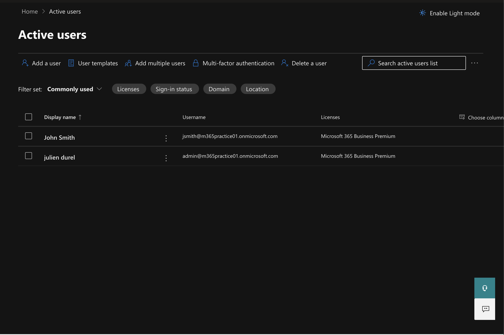
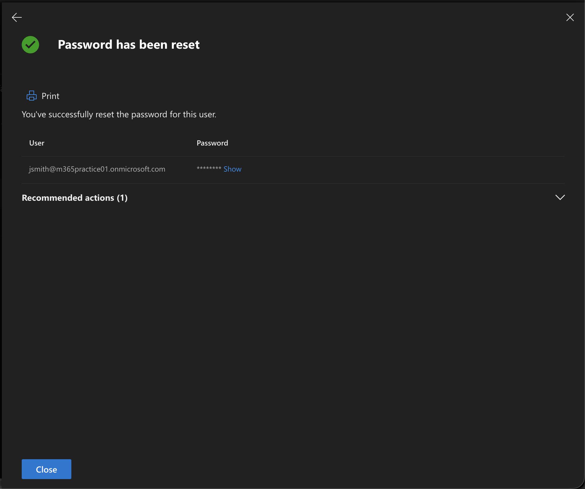

# Microsoft 365 / Entra Helpdesk Lab

## Overview

This lab demonstrates common Tier-1 helpdesk tasks performed in Microsoft 365 / Entra ID.

The goal is to simulate real helpdesk actions such as creating users and resetting passwords inside the Microsoft 365 Admin Center.

## Environment

Microsoft 365 Business Premium Trial  
Microsoft 365 Admin Center  
Entra ID (Identity Management)

## Tasks Performed

### 1. Create a User

A new user account was created inside the Microsoft 365 Admin Center.

Example user:

John Smith  
jsmith@m365practice01.onmicrosoft.com

Screenshot:

---

### 2. Reset User Password

Simulated a common helpdesk task by resetting the user's password.

Screenshot:

---

## Skills Demonstrated

- Microsoft 365 Admin Center
- User management
- Password reset
- Identity administration
- Tier-1 helpdesk workflow
